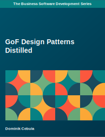

# Introduction

This repository contains GoF Design Patterns Examples used in my book "GoF Design Patterns Distilled".

# The book

"GoF Design Patterns Distilled" provides straight to a point, distilled explanation of GoF Design Patterns, originally
introduced in the book "Design Patterns: Elements of Reusable Object-Oriented Software" by Erich Gamma, Richard Helm,
Ralph Johnson, and John Vlissides.

The book covers all 23 design patterns, divided into three groups: Creational, Structural, and Behavioral.

Each design pattern is presented with a description, use cases, a diagram, and a meaningful example code. Example code
is written in Java.

The goal of this book is to teach you design patterns using meaningful examples and straight to the point descriptions.

The book is available on Leanpub and Amazon:

Leanpub: https://leanpub.com/gof-design-patterns

Amazon: https://www.amazon.com/Design-Patterns-Distilled-Dominik-Cebula-ebook/dp/B0C91X1GT8

# Design Patterns

## Creational

* Abstract Factory
* Builder
* Factory Method
* Prototype
* Singleton

## Structural

* Adapter
* Bridge
* Composite
* Decorator
* Facade
* Flyweight
* Proxy

## Behavioral

* [Chain of Responsibility](src/main/java/com/dominikcebula/edu/design/patterns/behavioral/chain/of/responsibility)
* Command
* Interpreter
* Iterator
* Mediator
* Memento
* Observer
* State
* Strategy
* Template Method
* Visitor

# Author

Dominik Cebula

* https://dominikcebula.com/

* https://blog.dominikcebula.com/

* https://www.udemy.com/user/dominik-cebula/
